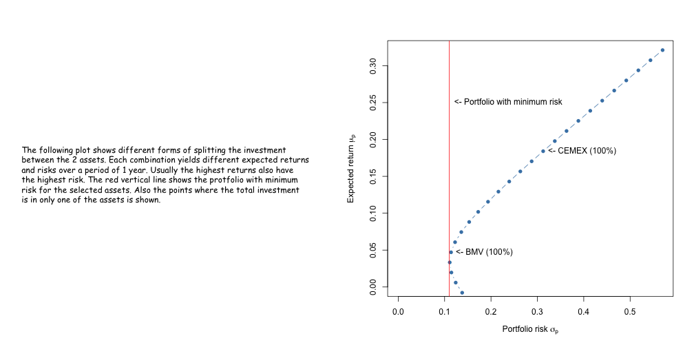

## Portfolio analysis

Assume we want to invest in 2 risky assets A and B that pays no dividends, where:

* $R_A$ = simple return on asset A over month t = $\frac{P_{At} - P_{At-1}}{P_{At-1}}$
  + $P_{At}$ is the price of asset A at the end of month t
* $R_B$ = simple return on asset B over month t = $\frac{P_{Bt} - P_{Bt-1}}{P_{Bt-1}}$
  + $P_{Bt}$ is the price of asset B at the end of month t
* $W_0$ = amount of the investment

We assume that $R_A$ and $R_B$ are independent and identically distributed random variables with $N(\mu_i, \Sigma_i), i = A, B$

Invsetors usually:
* Like high expected returns $E[R_i] = \mu_i$
* Dislike high volatility $var(R_i) = \sigma^2_i$

--- .class #id 

## Expected returns
We choose 2 assets from the Mexican Stock Exchange (BMV), symbols "^MXX", "CX". The first one is a composite index of the BMV, like the Dow Jones Industrial Average. The second is from CEMEX, a global building materials company.

To estimate the expected returns:
* We read the historic monthly prices of both assets from YAHOO, beginning on Apr/1, 2012 and ending on Apr/30, 2015. 
* We calculate the monthly return of each asset and from here we compute the mean and the standard deviation for each. The mean $\mu_i$ is the expected return and the standard deviation $\sigma_i$ represents the volatility or risk associated with asset i. 
* Then we annualized $\mu_i$ and $\sigma_i$.

---

## Portfolio composition
* $x_A$ = share of investment in asset A = $\frac{amt\:in\:A}{W_0}$
* $x_B$ = share of investment in asset B = $\frac{amt\:in\:B}{W_0}$

Where $x_A + x_B = 1$

* When $x_i > 0$ we have a long position, meaning we bougth $x_i \times W_0$ of asset i.
* When $x_i < 0$ we have a short position, meaning we borrow $x_i \times W_0$ of asset i to sold it to leverage the investment in other asset. 

In general, we have long positions in assets where we expect an increase in its prices and short positions in assets where we expect its prices to decrease.

The portfolio return is given by: $R_p = x_A R_A + x_b R_B$

The portfolio risk is: $\sigma^2_p = var(R_p) = x^2_A \sigma^2_A + x^2_B \sigma^2_B + 2x_A x_B \sigma_{AB}$

--- 

## Portfolio expected return and risk

 
